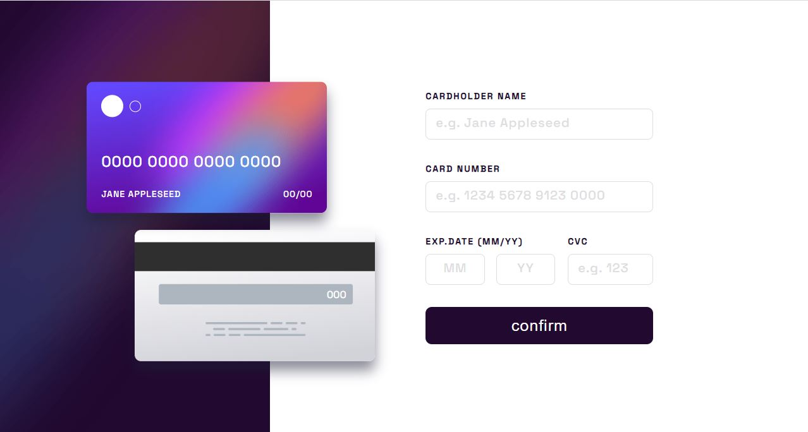

<h1 align="center">Interactive card details form
</h1>

 

   <a href="https://ahlam-alsaffarini.github.io/Interactive-card/"> Demo 🔥🤍</a>

   Solution for a challenge from  <a href="https://www.frontendmentor.io/challenges/interactive-card-details-form-XpS8cKZDWw" target="_blank">frontendmentor.io</a>.

 
 

## Overview

### The challenge

This a challenge is to be able to:

- Fill in the form and see the card details update in real-time
- Receive error messages when the form is submitted if:
  - Any input field is empty
  - The card number, expiry date, or CVC fields are in the wrong format
- View the optimal layout depending on their device's screen size
- See hover, active, and focus states for interactive elements on the page

## My process

### Built with

- Semantic HTML5 markup
- CSS custom properties
- Flexbox
- Mobile-first workflow

### Useful resources

- [MDN](https://developer.mozilla.org/en-US/)
- [stackoverflow](https://stackoverflow.com/)

## Acknowledgments

A big thank you to anyone providing feedback on my . It definitely helps to find new ways to code and find easier solutions!
